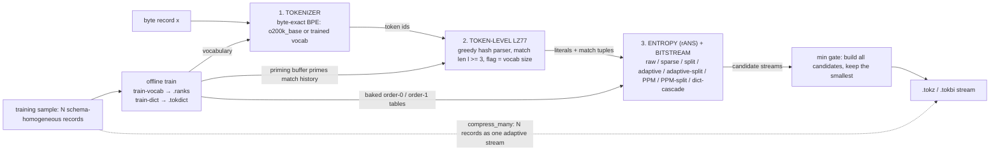

# TokPress (`tokpress`)

A pure-Python, **tokenizer-driven lossless compressor**: it tokenizes input with
tiktoken's `o200k_base` encoding (the tokenizer behind OpenAI's GPT models),
applies token-level LZ77, then entropy-codes the result with rANS. It is built
for **many small, independent, schema-homogeneous records** — structured logs,
telemetry, API responses, package metadata — where a trained shared dictionary
and a domain vocabulary beat generic whole-stream compressors on a per-record
basis.

> **What it is, in one answer.** TokPress compresses bytes losslessly by first
> converting them to LLM-style tokens, then compressing those tokens instead of
> the raw bytes. Because an LLM tokenizer already chunks text into frequent,
> semantically coherent pieces, tokenizing before LZ77 + entropy coding gives
> the compressor a better-shaped alphabet than raw bytes. On the workload it is
> designed for — many small JSON-style records compressed with a shared trained
> dictionary — it reaches **0.2537** (per record) and **0.2256** (batch), which
> beats every dictionary-less baseline and closes most of the gap to `zstd`
> with a matched dictionary (0.1371). It is pure Python, Apache-2.0, and needs
> only one runtime dependency (`tiktoken`).

`pip install`, import, done.

## Contents

1. [What problem does it solve?](#what-problem-does-it-solve)
2. [How it works](#how-it-works)
3. [Quick facts](#quick-facts)
4. [Install](#install)
5. [Usage](#usage)
6. [Integrity and mismatch protection](#integrity-and-mismatch-protection)
7. [Trained dictionaries](#trained-dictionaries-many-small-schema-similar-records)
8. [Custom vocabulary training (`train-vocab`)](#custom-vocabulary-training-train-vocab)
9. [Measured, honestly](#measured-honestly)
10. [When to use it, when not to](#when-to-use-it-when-not-to)
11. [Performance](#performance-and-compression-ratio)
12. [Testing](#testing)
13. [FAQ](#faq)
14. [Further reading](#further-reading)
15. [Project layout](#project-layout)

---

## What problem does it solve?

Compressing *one record at a time* is hard for every compressor: there is no
history to learn from, and per-record headers cost real bytes. Compressing a
*batch* of independent records — a log file, a day of API responses, a package
registry dump — as a stream works better but loses the record boundary.

TokPress targets the regime in between, where the big cloud databases and log
ingestion pipelines already spend real money on **dictionary compression**: many
small records that all share one schema. Its answer is a `TokDict` — a dictionary
trained once on a sample of records, then reused to compress every future record
of the same shape via shared LZ history and pre-baked entropy tables (the same
mechanism MongoDB / DocumentDB 8.0's per-collection zstd dictionaries and
[RFC 9842 Compression Dictionary Transport](https://www.rfc-editor.org/rfc/rfc9842.html)
standardize on the web).

## How it works



Read it top-to-bottom for encode. The two off-axis arrows carry the project's
claim: `TokDict`'s priming buffer lets one record match against material learned
from *other* records, and its baked tables give a pre-trained entropy model instead
of a per-record one. The dashed edge is the batch mode (`compress_many`), which
codes all N records as one stream so the adaptive model spans the batch.

Two ways to use it:

- **Single record**: `compress(data)` → one `.tokz` stream.
- **Many records as one adaptive stream**: `compress_many(records)` → a
  `TOKB` container with per-record lengths. Because the whole batch is
  entropy-coded as one stream, the adaptive model and the LZ history span
  *all* records — dramatically smaller than compressing each record
  independently on many small homogeneous records.

**Why a tokenizer?** An LLM tokenizer's job — chunking input into frequent,
semantically coherent pieces — is close to what a compressor's dictionary wants.
Evidence that this signal is real: tokenizer quality correlates with
compression (Goldman et al., EMNLP 2024, via this project's `tokenize-stats`),
and LLM-based compression (LLMZip 2023; DeepMind's "Language Modeling Is
Compression", 2023) shows a *trained predictor* beats state-of-the-art
compressors — TokPress captures the cheap, dependency-free end of that spectrum
(a pretrained vocabulary + a shared dictionary + an entropy coder, with no
neural network at compress time).

## Quick facts

| | |
|---|---|
| **What** | Lossless, tokenizer-driven text/structured-record compressor |
| **Tokenizer** | tiktoken `o200k_base` (or a custom trained vocabulary) |
| **Entropy coding** | rANS (asymmetric numeral systems) over LZ77 match tuples |
| **Target workload** | Many small, schema-homogeneous records (JSON logs, telemetry, API/package metadata) |
| **Python API** | `compress` / `decompress` / `compress_many` / `decompress_many` / `iter_decompress_many` / `TokDict.train` / `tokenize_stats` |
| **CLI** | `tokpress compress|decompress|pack|unpack|read|bench|tokenize-stats|train-dict|train-vocab|fit` |
| **Language** | Pure Python (3.10+) |
| **Dependencies** | `tiktoken` only |
| **License** | Apache-2.0 |
| **Verification** | 124 tests + a deterministic ratio-regression gate in CI |

---

## Install

```bash
cd tokpress
pip install -e .
```

The only third-party dependency is `tiktoken`.

---

## Usage

### CLI

```bash
# single record
tokpress compress path/to/record.json -o record.tokz
tokpress decompress record.tokz -o restored.json

# batch: many records as one adaptive stream
tokpress pack batch.tokz record1.json record2.json ...
tokpress unpack batch.tokz out_dir/            # writes 0000.rec, 0001.rec, ...

# diagnostics / tooling
tokpress bench path/to/file
tokpress tokenize-stats path/to/file           # tokens/KB, entropy, MI
tokpress train-dict mydict.tokdict sample1.json sample2.json ...
tokpress train-vocab myvocab.ranks corpus1.txt corpus2.txt ...
```

### Python API

```python
import tokpress

compressed = tokpress.compress(payload)  # payload: bytes or str
original = tokpress.decompress(compressed)  # -> bytes, byte-exact

records = [b'{"user": "u1"}', b'{"user": "u2"}']
packed = tokpress.compress_many(records)  # one adaptive stream
assert tokpress.decompress_many(packed) == records

stats = tokpress.tokenize_stats(payload)  # tokenizer-quality stats
```

### Integrity and mismatch protection

Lossless compressors that decode into silently-wrong bytes are the worst kind
of bug, so TokPress has three guards:

- **Wrong vocabulary raises.** Any stream compressed with a non-default
  vocabulary (`--vocab` / a custom `tokenizer=`) carries an 8-byte vocabulary
  fingerprint. Decompressing it against a different rank file raises instead
  of corrupting silently. Plain `o200k_base` streams are untouched (no stamp,
  byte-identical output).
- **Wrong dictionary raises.** A stream compressed with a `TokDict` carries an
  8-byte fingerprint of it and refuses to decompress against the wrong one.
- **`--integrity` makes corruption loud.** `tokpress compress --integrity`
  (or `compress(..., integrity=True)`, `pack --integrity`) appends a crc32 of
  the input (+4 bytes/stream). Decompression then detects a flipped bit,
  truncation, or a decode under the wrong model instead of returning wrong
  bytes. Opt-in because it costs bytes on every stream.

`--fast` (compress only) emits a single pre-chosen entropy candidate
(adaptive-split) instead of the min-over-modes gate: on whole files it costs
~4% ratio for ~12% less encode time; on records under ~512 tokens it is
ratio-neutral (that candidate wins the gate anyway) but only ~5% faster. It
cannot be combined with `--dict`.

### Trained dictionaries (many small, schema-similar records)

If you have many small records that share structure — JSON log lines,
events, schema-homogeneous documents — train a `TokDict` once on a sample
and reuse it across every future record of that shape. This is the regime
TokPress is actually built for: a lone small record compressed on its own
can inflate, but a trained dictionary gives it shared cross-record LZ
history and a pre-baked entropy table instead of paying a per-record table
from scratch.

```bash
tokpress train-dict mydict.tokdict sample1.json sample2.json ...
tokpress compress new_record.json --dict mydict.tokdict -o new_record.tokz
tokpress decompress new_record.tokz --dict mydict.tokdict -o restored.json
```

```python
import tokpress

dictionary = tokpress.TokDict.train(sample_records)  # list[bytes]
dictionary.save("mydict.tokdict")

dictionary = tokpress.TokDict.load("mydict.tokdict")
compressed = tokpress.compress(record, dictionary=dictionary)
restored = tokpress.decompress(compressed, dictionary=dictionary)
```

The same dictionary must be available at decompress time; a stream
compressed with a dictionary carries only an 8-byte fingerprint of it, not
the dictionary itself, and refuses to decompress against the wrong one.

Batch + dictionary: `pack`/`compress_many` accept `--dict`, so one adaptive
stream over a batch of records can also be primed with the trained
dictionary.

### Custom vocabulary training (`train-vocab`)

`train-vocab` learns a byte-level BPE vocabulary from your corpus and writes
it as a tiktoken-format rank file. Use it with `--vocab` on any
compress/decompress/pack/unpack command — the same vocab must be supplied on
both ends.

```bash
tokpress train-vocab myvocab.ranks corpus.txt --vocab-size 4096
tokpress compress record.json -o record.tokz --vocab myvocab.ranks
tokpress decompress record.tokz -o out.json --vocab myvocab.ranks
```

```python
from tokpress.tokenizer import bpe_trainer
from tokpress.tokenizer.tiktoken_adapter import TiktokenTokenizer

ranks = bpe_trainer.train_mergeable_ranks(corpus_bytes, 4096)
tt = TiktokenTokenizer(encoding=bpe_trainer.build_tiktoken_encoding(ranks))
compressed = tokpress.compress(record, tokenizer=tt)
```

The trainer produces a *valid* hierarchical BPE merge chain (a restricted
vocabulary is only a correct tokenizer if every token is a merge of two
lower-ranked tokens — the project's earlier naive approach violated this),
and it pre-tokenizes with the same regex tiktoken's encoder uses so the
vocab is reproduced exactly. On a matching domain it beats `o200k_base`
when records are compressed independently with no dictionary: a JSON-log
vocabulary trained on 400 records compressed held-out JSON records to
**0.162 vs 0.178** for `o200k_base`. (With a trained `TokDict` supplying the
domain structure the comparison flips — see the
[FAQ on custom vocabularies](#faq).)
Correctness-first trainer — use the `--max-bytes` cap to sample the corpus
(default 256 KB).

---

## Measured, honestly

On real held-out JSON log records (`scripts/bench.py`'s trained-dictionary
regime), with a `TokDict` trained on a disjoint training split (paper-scale
split, 46 held-out records; default `cover` priming picker; repeated-seeded
5-split means are ~0.254 / 0.232):

| backend | ratio (held-out records) |
|---|---|
| per-record, no dictionary | 0.8078 |
| per-record + `TokDict` | 0.2537 |
| **batch (`compress_many`) + `TokDict`** | **0.2256** |
| `zstd -19` + matched dict, batch (blob) | 0.1371 |

TokPress beats every dictionary-less baseline and most of the gap to zstd's
matched dictionary, but zstd's mature COVER/FastCover dictionary training
and FSE tables remain ahead. Reproduce with `python scripts/bench.py`.

### Whole-file comparison (no dictionary)

For context, here is TokPress on four of the vendored whole-file corpora,
compared with standard byte-level compressors (ratio, lower is better; same
file compressed whole, no dictionary, `scripts/bench.py`):

| corpus | gzip -9 | zstd -19 | bz2 -9 | brotli -11 | **tokpress** |
|---|---|---|---|---|---|
| prose (alice29.txt, 152 KB) | 0.3563 | 0.3236 | 0.2841 | 0.3057 | **0.2976** |
| Python source (300 KB) | 0.2415 | 0.2190 | 0.2171 | 0.2057 | **0.2331** |
| C source (fields.c, 11 KB) | 0.2804 | 0.2706 | 0.2726 | 0.2437 | 0.3362 |
| JSON logs (json_heldout, 122 KB) | 0.1584 | 0.1396 | 0.1319 | 0.1328 | 0.1979 |

TokPress **beats gzip on prose and Python code and beats zstd on prose**,
but trails bz2/brotli/lzma and zstd on most whole-file corpora — it is a
per-record/dictionary tool first, not a general whole-stream replacement for
native compressors. The interesting result is that tokenizing before
entropy-coding at all is competitive with whole-file gzip on plain prose
without any shared dictionary.

### Which tiktoken encoding should I use?

TokPress defaults to `o200k_base` (the tokenizer behind OpenAI's GPT-4o
models). The other encodings tiktoken ships can be swapped in by constructing
`TiktokenTokenizer(encoding_name=...)` and passing `tokenizer=` to the API —
all five are byte-exact on arbitrary input through this codec. Measured on the
same corpora (ratio, lower is better):

Whole-file, no dictionary:

| encoding | vocab | prose (alice29) | C code (fields.c) | JSON logs |
|---|---|---|---|---|
| `cl100k_base` | 100,277 | **0.2970** | **0.3341** | **0.1968** |
| **`o200k_base` (default)** | 200,019 | 0.2976 | 0.3362 | 0.1979 |
| `p50k_base` / `r50k_base` / `gpt2` | ~50k | 0.3090–0.3109 | 0.3542–0.3640 | 0.2035 |

Trained-`TokDict` regime (json_heldout, 184 train / 46 held-out records),
measured under the earlier `concat` priming default so every row is comparable:

| encoding | per no-dict | per + `TokDict` | batch + `TokDict` |
|---|---|---|---|
| `byte-BPE @4096` (custom) | **0.6046** | 0.2988 | 0.2470 |
| **`o200k_base` (default)** | 0.8078 | **0.2554** | **0.2309** |
| `cl100k_base` | 0.7988 | 0.2717 | 0.2311 |
| `p50k_base` / `r50k_base` / `gpt2` | 0.8618 | 0.2711 | 0.2422 |

The takeaway is consistent with the [custom-vocabulary FAQ](#faq): the default
`o200k_base` is already the right choice for the target dictionary/batch
regime; `cl100k_base` edges it by ~0.5% on whole-file/no-dictionary
compression only, and the ~50k-vocab encodings lose everywhere it matters. A
small vocabulary wins in exactly one niche — independent per-record
compression with no dictionary — where it merely shrinks the per-record header.
Single-split/single-file measurements; deltas under ~1% are near split noise.
Under the current `cover` default the `o200k_base` row improves to 0.2537
per-record / 0.2256 batch (the other encodings were not re-measured).

---

## When to use it, when not to

**Use TokPress when** you have many records that share a schema — log lines,
telemetry events, API responses, package metadata — and you can train a
dictionary (or want a `compress_many` batch stream). That is the workload it
beats gzip/zstd/lzma on, per record, and where a trained `TokDict` turns a
0.8×-inflating per-record result into ~0.25×.

**Don't use it when** records are large, one-off, or already highly repetitive
(whole files), when you need zstd-class throughput (TokPress is deliberately
pure Python and slower), or when you have no training data and must compress
one tiny record in isolation — without a dictionary, small records can come
out *larger* than the input (measured: 0.81× on schema-homogeneous records
compressed one at a time). Use `compress_many` (batch mode) to fix that even
without a dictionary.

## Performance and compression ratio

TokPress is pure Python; expect noticeably lower throughput than a compiled/
native implementation, dominated by Python-level per-symbol loop overhead in
the rANS coder. It has not been optimized for speed. Decompression runs only
the mode the encoder chose and is far faster than compression, which builds
several candidate modes per record and keeps the smallest.

---

## Testing

```bash
pip install -e .
pytest tests/
```

The suite (124 tests) covers bitstream and rANS roundtrips (incl. the
single-symbol-alphabet edge case), token-level LZ77 roundtrip, the tiktoken
adapter's byte-exact roundtrip on arbitrary binary input (including invalid
UTF-8), full codec roundtrips across payload shapes, `TokDict`
training/save/load/escape-cascade roundtrips (incl. the ablation knobs, all
four priming-buffer constructions -- concat/coverage/diverse/cover -- the
4096-token priming-cap default, and fingerprint rejection of a wrong
dictionary), the batch and indexed-batch
modes, the BPE trainer (merge-chain validity, determinism, tiktoken
agreement, rank-file roundtrip), custom-vocab codec roundtrips (incl. the
identity-stamp rejection of a wrong vocabulary), the opt-in integrity trailer
(corruption and wrong-model decode raise instead of returning wrong bytes),
the escape-capped high-vocabulary adaptive/PPM modes, `tokenize_stats`
invariants, and black-box package/CLI tests. Heavy large-payload tests are
marked `@pytest.mark.slow` (`make test-quick` skips them). A self-contained
ratio regression gate (`scripts/bench_regression.py`, deterministic synthetic
corpora, no external data) fails on any accidental wire-format/table
regression and runs nightly in CI alongside the full suite.

---

## FAQ

**Is TokPress lossless?**
Yes. Decompression returns the original bytes exactly (`byte-exact`), including
arbitrary binary input with lone invalid-UTF-8 bytes — tiktoken's byte-level
`_encode_bytes`/`decode_bytes` pair round-trips anything.

**How is a "tokenizer-driven" compressor different from gzip / zstd / brotli?**
Those compress raw bytes with byte-level LZ + Huffman/FSE. TokPress first
converts bytes to token ids with tiktoken's `o200k_base` (the tokenizer used by
OpenAI's GPT models), then applies token-level LZ77 and rANS entropy coding.
The token stream is a better alphabet for a compressor because frequent,
semantically coherent pieces are already merged into single symbols.

**Does it compress arbitrary binary data, or only text?**
Arbitrary bytes. Because the tokenizer backend is byte-exact, TokPress round-trips
binary records too — it is not limited to valid UTF-8 text.

**When is TokPress smaller than the input?**
In its designed regime: many small, schema-homogeneous records, compressed with
a trained `TokDict` and/or as one `compress_many` adaptive batch stream
(measured ~0.25× on held-out JSON logs). A single small record compressed alone,
without a dictionary, can inflate — the per-record header and table cost more
than the record's own redundancy saves.

**Do I need to train a dictionary?**
For single records and whole files, no — TokPress works out of the box with
`o200k_base`. For the many-small-schema-homogeneous-records regime it is built
for, train a `TokDict` once on a sample (`tokpress train-dict`) and reuse it; or
skip training and use `compress_many`/`pack`, which shares LZ history across the
whole batch.

**How does TokPress compare to `zstd` with a trained dictionary?**
Honestly: zstd still wins. On the paper-scale held-out JSON records, per-record
`tokpress+dict` is 0.2537 and batch is 0.2256, vs 0.1371 for zstd-19 with a
matched dictionary compressed as a blob. zstd's COVER/FastCover dictionary
training and FSE tables are more mature. TokPress's result is that it beats
every *dictionary-less* baseline, and its `.tokdict` + batch mode is an open,
pure-Python reference for the technique.

**Is TokPress an LLM / AI compressor?**
No neural network runs at compress or decompress time. TokPress only reuses the
*tokenizer* (a pretrained BPE vocabulary) — the heavy part is LZ77 + rANS in
pure Python. LLM-as-predictor compressors are the known ceiling here, but they
need a multi-billion-parameter model per record; TokPress is the cheap end of
that idea.

**Is a custom trained vocabulary better than `o200k_base`?**
It depends on the regime, and both directions are measured on the same JSON-log
corpus. When records are compressed *independently with no dictionary*, a small
domain-trained vocabulary (byte-BPE or SentencePiece) wins, purely by cutting
the per-record header/alphabet cost (0.162 vs 0.178 on the trained-vocab corpus;
0.64 vs 0.81 on json_heldout's held-out records). When a trained `TokDict`
supplies the domain structure, the positions reverse — `o200k_base` wins
(0.2537 vs 0.31–0.44 for 4k–16k domain vocabs) because the dictionary amortizes
the alphabet and the larger, better-tuned merge stream then dominates. So:
train a vocabulary for dictionary-less per-record work; keep `o200k_base` when
you are already training a `TokDict`.

**Which tiktoken encoding should I use — `o200k_base` or `cl100k_base`?**
`o200k_base` (the default) is the right choice for TokPress's target workload.
Measured head-to-head, `cl100k_base` is a hair better only on whole-file,
no-dictionary compression (~0.5% smaller on prose/code/JSON), while
`o200k_base` wins the trained-dictionary regime (per-record+dict 0.2554 vs
0.2717, batch+dict 0.2309 vs 0.2311; both measured under the earlier `concat`
default — the `o200k_base` side is 0.2537 / 0.2256 under the current `cover`
default, while `cl100k_base` was not re-measured). The ~50k-vocab encodings
(`p50k_base`/`r50k_base`/`gpt2`) lose in both regimes. Keep the default unless
your workload is exclusively whole-file compression with no dictionary — then
`cl100k_base` is a measured, if small, win.

**What are the dependencies and license?**
One runtime dependency (`tiktoken`), Python 3.10+, Apache-2.0.

**What file formats does it use?**
`.tokz` for single records, `TOKB` for a batch-as-one-adaptive-stream container,
`TOKBI` for indexed batches with per-record random access, `.tokdict` for
trained dictionaries, and tiktoken-format `.ranks` for custom vocabularies.

---

## Further reading

- [tiktoken (OpenAI) — the BPE tokenizer backend](https://github.com/openai/tiktoken)
- [rANS notes (Fabian Giesen) — the entropy coder](https://fgiesen.wordpress.com/2014/02/02/rans-notes/)
- [RFC 9842 — Compression Dictionary Transport (zstd/brotli shared dictionaries over HTTP)](https://www.rfc-editor.org/rfc/rfc9842.html)
- [Language Modeling Is Compression (DeepMind, 2023)](https://arxiv.org/abs/2309.10668)
- [An Information-Theoretic Perspective on LLM Tokenizers (Goldman et al., 2024)](https://arxiv.org/abs/2601.09039)
- [zstd COVER/FastCover dictionary training](https://github.com/facebook/zstd/issues/1654)
- [MongoDB / DocumentDB per-collection zstd dictionary compression](https://www.mongodb.com/developer/products/mongodb/mongodb-dictionary-compression/)

---

## Project layout

```
tokpress/
├── src/tokpress/
│   ├── bitstream/          # LSB-first bit reader/writer, LEB128 varints
│   ├── entropy/            # SymbolStats, rANS
│   ├── tokenizer/          # TiktokenTokenizer (o200k_base / custom)
│   │   └── bpe_trainer.py  # whole-corpus BPE trainer (train-vocab)
│   ├── codec/              # token-LZ77, encoder/decoder (wire format)
│   ├── dictionary.py       # TokDict: trained cross-record dictionary
│   ├── native.py           # the runtime encoder/decoder pair
│   ├── core.py             # public compress/decompress/... API
│   └── cli.py              # `tokpress` command-line entry point
└── tests/
```
