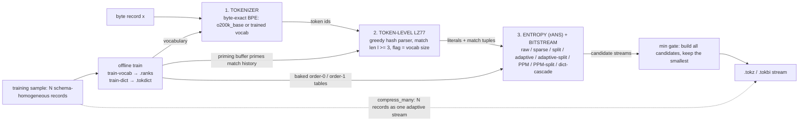

# TokPress (`tokpress`)

### A tiktoken-tokenizer-driven lossless compressor

TokPress is a pure-Python, stdlib-first (aside from `tiktoken`) lossless
compressor: it tokenizes input with tiktoken's `o200k_base` encoding (the
same tokenizer OpenAI's models use), applies token-level LZ77, then
entropy-codes the result with rANS. The core idea is that an LLM
tokenizer's job — chunking input into frequent, semantically coherent
pieces — is close to what a compressor's dictionary wants, so tokenizing
before compressing gives the LZ and entropy stages a better-shaped alphabet
than raw bytes.

It is built for **many small, independent, schema-homogeneous records**
(structured logs, telemetry, API responses, package metadata), where a
trained shared dictionary and a domain vocabulary beat generic
whole-stream compressors on a per-record basis.

`pip install`, import, done.

---

## Architecture



Read it top-to-bottom for encode. The two off-axis arrows carry the project's
claim: `TokDict`'s priming buffer lets one record match against material learned
from *other* records, and its baked tables give a pre-trained entropy model instead
of a per-record one. The dashed edge is the batch mode (`compress_many`), which
codes all N records as one stream so the adaptive model spans the batch.

Two ways to use it:

- **Single record**: `compress(data)` → one `.tokz` stream.
- **Many records as one adaptive stream**: `compress_many(records)` → a
  `TOKB` container with per-record lengths. Because the whole batch is
  entropy-coded as one stream, the adaptive model and the LZ history span
  *all* records — dramatically smaller than compressing each record
  independently on many small homogeneous records.

---

## Install

```bash
cd tokpress
pip install -e .
```

The only third-party dependency is `tiktoken`.

---

## Usage

### CLI

```bash
# single record
tokpress compress path/to/record.json -o record.tokz
tokpress decompress record.tokz -o restored.json

# batch: many records as one adaptive stream
tokpress pack batch.tokz record1.json record2.json ...
tokpress unpack batch.tokz out_dir/            # writes 0000.rec, 0001.rec, ...

# diagnostics / tooling
tokpress bench path/to/file
tokpress tokenize-stats path/to/file           # tokens/KB, entropy, MI
tokpress train-dict mydict.tokdict sample1.json sample2.json ...
tokpress train-vocab myvocab.ranks corpus1.txt corpus2.txt ...
```

### Python API

```python
import tokpress

compressed = tokpress.compress(payload)  # payload: bytes or str
original = tokpress.decompress(compressed)  # -> bytes, byte-exact

records = [b'{"user": "u1"}', b'{"user": "u2"}']
packed = tokpress.compress_many(records)  # one adaptive stream
assert tokpress.decompress_many(packed) == records

stats = tokpress.tokenize_stats(payload)  # tokenizer-quality stats
```

### Integrity and mismatch protection

Lossless compressors that decode into silently-wrong bytes are the worst kind
of bug, so TokPress has three guards:

- **Wrong vocabulary raises.** Any stream compressed with a non-default
  vocabulary (`--vocab` / a custom `tokenizer=`) carries an 8-byte vocabulary
  fingerprint. Decompressing it against a different rank file raises instead
  of corrupting silently. Plain `o200k_base` streams are untouched (no stamp,
  byte-identical output).
- **Wrong dictionary raises.** A stream compressed with a `TokDict` carries an
  8-byte fingerprint of it and refuses to decompress against the wrong one.
- **`--integrity` makes corruption loud.** `tokpress compress --integrity`
  (or `compress(..., integrity=True)`, `pack --integrity`) appends a crc32 of
  the input (+4 bytes/stream). Decompression then detects a flipped bit,
  truncation, or a decode under the wrong model instead of returning wrong
  bytes. Opt-in because it costs bytes on every stream.

`--fast` (compress only) emits a single pre-chosen entropy candidate
(adaptive-split) instead of the min-over-modes gate: on whole files it costs
~4% ratio for ~12% less encode time; on records under ~512 tokens it is
ratio-neutral (that candidate wins the gate anyway) but only ~5% faster. It
cannot be combined with `--dict`.

### Trained dictionaries (many small, schema-similar records)

If you have many small records that share structure — JSON log lines,
events, schema-homogeneous documents — train a `TokDict` once on a sample
and reuse it across every future record of that shape. This is the regime
TokPress is actually built for: a lone small record compressed on its own
can inflate, but a trained dictionary gives it shared cross-record LZ
history and a pre-baked entropy table instead of paying a per-record table
from scratch.

```bash
tokpress train-dict mydict.tokdict sample1.json sample2.json ...
tokpress compress new_record.json --dict mydict.tokdict -o new_record.tokz
tokpress decompress new_record.tokz --dict mydict.tokdict -o restored.json
```

```python
import tokpress

dictionary = tokpress.TokDict.train(sample_records)  # list[bytes]
dictionary.save("mydict.tokdict")

dictionary = tokpress.TokDict.load("mydict.tokdict")
compressed = tokpress.compress(record, dictionary=dictionary)
restored = tokpress.decompress(compressed, dictionary=dictionary)
```

The same dictionary must be available at decompress time; a stream
compressed with a dictionary carries only an 8-byte fingerprint of it, not
the dictionary itself, and refuses to decompress against the wrong one.

Batch + dictionary: `pack`/`compress_many` accept `--dict`, so one adaptive
stream over a batch of records can also be primed with the trained
dictionary.

### Custom vocabulary (`train-vocab` + `--vocab`)

`train-vocab` learns a byte-level BPE vocabulary from your corpus and writes
it as a tiktoken-format rank file. Use it with `--vocab` on any
compress/decompress/pack/unpack command — the same vocab must be supplied on
both ends.

```bash
tokpress train-vocab myvocab.ranks corpus.txt --vocab-size 4096
tokpress compress record.json -o record.tokz --vocab myvocab.ranks
tokpress decompress record.tokz -o out.json --vocab myvocab.ranks
```

```python
from tokpress.tokenizer import bpe_trainer
from tokpress.tokenizer.tiktoken_adapter import TiktokenTokenizer

ranks = bpe_trainer.train_mergeable_ranks(corpus_bytes, 4096)
tt = TiktokenTokenizer(encoding=bpe_trainer.build_tiktoken_encoding(ranks))
compressed = tokpress.compress(record, tokenizer=tt)
```

The trainer produces a *valid* hierarchical BPE merge chain (a restricted
vocabulary is only a correct tokenizer if every token is a merge of two
lower-ranked tokens — the project's earlier naive approach violated this),
and it pre-tokenizes with the same regex tiktoken's encoder uses so the
vocab is reproduced exactly. On a matching domain it beats `o200k_base`:
a JSON-log vocabulary trained on 400 records compressed held-out JSON
records to **0.162 vs 0.178** for `o200k_base`. Correctness-first trainer —
use the `--max-bytes` cap to sample the corpus (default 256 KB).

### Measured, honestly

On real held-out JSON log records (`scripts/bench.py`'s trained-dictionary
regime), with a `TokDict` trained on a disjoint training split:

| backend | ratio (held-out records) |
|---|---|
| per-record, no dictionary | 0.806 |
| per-record + `TokDict` | 0.2565 |
| **batch (`compress_many`) + `TokDict`** | **0.228** |
| `zstd -19` + matched dict, batch (blob) | 0.137 |

TokPress beats every dictionary-less baseline and most of the gap to zstd's
matched dictionary, but zstd's mature COVER/FastCover dictionary training
and FSE tables remain ahead. Reproduce with `python scripts/bench.py`.

---

## Testing

```bash
pip install -e .
pytest tests/
```

The suite (109 tests) covers bitstream and rANS roundtrips (incl. the
single-symbol-alphabet edge case), token-level LZ77 roundtrip, the tiktoken
adapter's byte-exact roundtrip on arbitrary binary input (including invalid
UTF-8), full codec roundtrips across payload shapes, `TokDict`
training/save/load/escape-cascade roundtrips (incl. the ablation knobs,
coverage/diversity priming, and fingerprint rejection of a wrong dictionary),
the batch and indexed-batch modes, the BPE trainer (merge-chain validity,
determinism, tiktoken agreement, rank-file roundtrip), custom-vocab codec
roundtrips (incl. the identity-stamp rejection of a wrong vocabulary), the
opt-in integrity trailer (corruption and wrong-model decode raise instead of
returning wrong bytes), the escape-capped high-vocabulary adaptive/PPM modes,
`tokenize_stats` invariants, and black-box package/CLI tests. Heavy
large-payload tests are marked `@pytest.mark.slow` (`make test-quick` skips
them). A self-contained ratio regression gate (`scripts/bench_regression.py`,
deterministic synthetic corpora, no external data) fails on any accidental
wire-format/table regression and runs nightly in CI alongside the full suite.

---

## Performance and compression ratio

TokPress is pure Python; expect noticeably lower throughput than a compiled/
native implementation, dominated by Python-level per-symbol loop overhead in
the rANS coder. It has not been optimized for speed.

Without a trained dictionary, every record is compressed independently, so
small or non-repetitive records can come out **larger** than the input. The
`compress_many` batch mode and a trained `TokDict` fix this for
many-small-homogeneous-records workloads, but only when you have
representative training data to build a dictionary from.

---

## Project layout

```
tokpress/
├── src/tokpress/
│   ├── bitstream/          # LSB-first bit reader/writer, LEB128 varints
│   ├── entropy/            # SymbolStats, rANS
│   ├── tokenizer/          # TiktokenTokenizer (o200k_base / custom)
│   │   └── bpe_trainer.py  # whole-corpus BPE trainer (train-vocab)
│   ├── codec/              # token-LZ77, encoder/decoder (wire format)
│   ├── dictionary.py       # TokDict: trained cross-record dictionary
│   ├── native.py           # the runtime encoder/decoder pair
│   ├── core.py             # public compress/decompress/... API
│   └── cli.py              # `tokpress` command-line entry point
└── tests/
```
