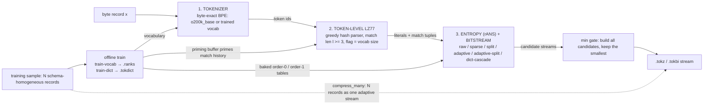

# TokPress — Proposed pipeline diagram

This documents the figure that `docs/research.tex`'s `fig:architecture`
placeholder should eventually contain. It is the one illustration that carries
the paper's core claim: tokenization reshapes the alphabet, then a *shared,
trained* model (TokDict) and the batch mode let many small records amortize the
per-record cost that kills generic compressors.

## What to draw

One horizontal pipeline with three stages, plus an off-axis "training" block
feeding the middle and third stages, plus a batch-mode callout:

```
[ byte record x ]
        |
        v
[ 1. TOKENIZER ]  --token ids-->  [ 2. TOKEN-LZ77 ]  --literals + match tuples-->  [ 3. ENTROPY (rANS) + BITSTREAM ]
        |                              |  ^                                              |
        |                              |  | primes LZ match history                    | builds N candidates, keeps smallest
        |                              v  |                                              v
        |                         [ TokDict ] <------------------------------- [ .tokz / .tokbi stream ]
        |                              ^
        |                              |
        +---- training sample ---- [ train: vocab + TokDict ]
```

Read it top-to-bottom for encode, and note the two arrows a reader might miss:
(1) `TokDict`'s priming buffer feeds the LZ matcher's history, so matches can
reach into *other* records, not just the current one; (2) the entropy stage
emits several candidate encodings (raw / sparse / split / adaptive /
adaptive-split / TokDict-cascade) and keeps the smallest — show a small
"min" gate on the right.

## Mermaid source

Renders the same pipeline as the ASCII sketch above. View it on
[mermaid.live](https://mermaid.live/) or in any Mermaid-enabled Markdown
renderer; it is the working source of truth for the diagram until the figure
is drawn in a vector tool.



Notes on the edges that carry the paper's claim:

- `H --> C` (priming buffer → LZ77) and `H --> D` (baked tables → entropy) are
  the two arrows most readers miss: they are the *shared, trained* state that
  lets one record compress against material learned from other records.
- `G -.-> F` is the batch-mode callout: `compress_many` codes all N records as
  one stream, so the adaptive entropy model spans the batch instead of each
  record paying a per-record table.
- The escape cascade (context → order-0 → out-of-band uint32) is not a node;
  add it as a small inset near the `H --> D` edge if space allows.

## Suggested annotations

- Stage 1 label: "byte-exact BPE tokenizer (`o200k_base`, or a trained vocab)".
- Stage 2 label: "token-level LZ77, `l >= 3` match threshold, match flag = `|V|`".
- Stage 3 label: "rANS, `M = 2^16`, 64-bit state; six candidate modes".
- Off-axis box: "offline training: `train-vocab` + `train-dict` → `.ranks` + `.tokdict`".
- Batch callout: "`compress_many` codes N records as one stream → adaptive model spans the batch".
- Escape cascade inset (optional, small): "context → order-0 → out-of-band uint32".

## Formats

- Preferred: a single `.tex`-friendly vector source (TikZ) compiled to PDF/PNG,
  inserted with `\includegraphics{figures/architecture}` at `fig:architecture`.
- Acceptable: a hand-drawn or diagram-tool PNG/SVG at >= 600 px wide, dark-on-light,
  matching the paper's black-on-white style.

## Layout rules

- Two-column width: the figure is `\linewidth` inside a `table*`/`figure*` (full-width) float.
- Keep text labels short (no sentences); the caption in the paper carries the prose.
- Emphasize the two "shared state" arrows (priming buffer, batch model) — they are
  the differentiation from a plain per-record codec.
